# Compilation des Diagrammes PlantUML

Ce fichier contient 12 diagrammes.

---

## Source : `Connexion.puml`

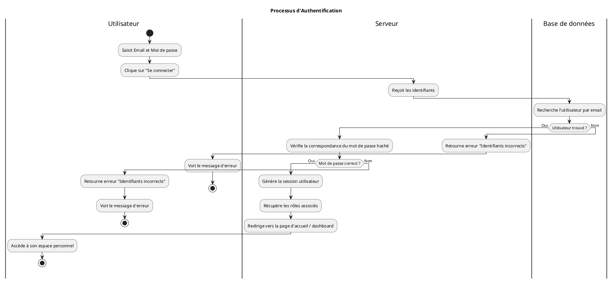

---

## Source : `Gestion_Categories.puml`

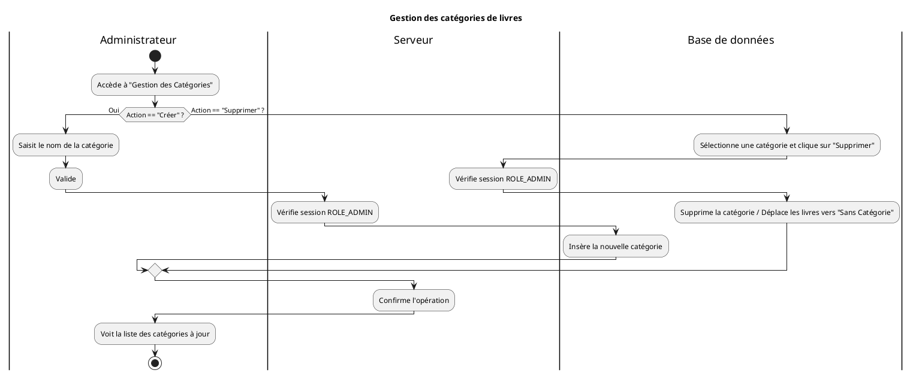

---

## Source : `gestion_panier.puml`

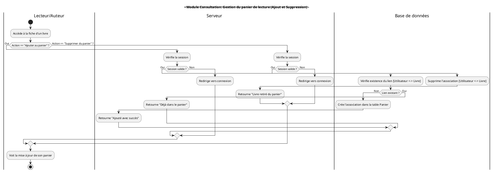

---

## Source : `Gestion_Utilisateur_et_Rôle.puml`

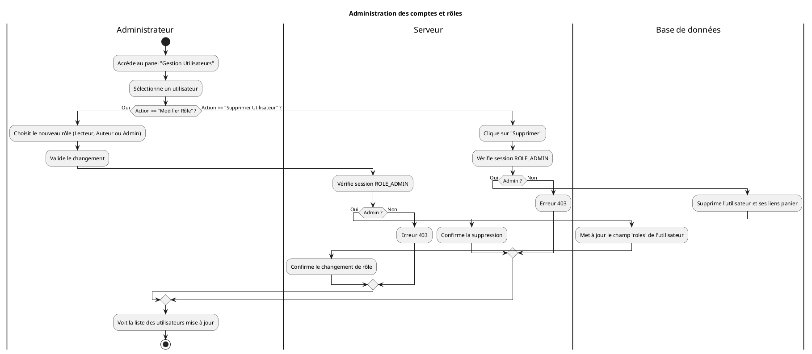

---

## Source : `Inscription.puml`

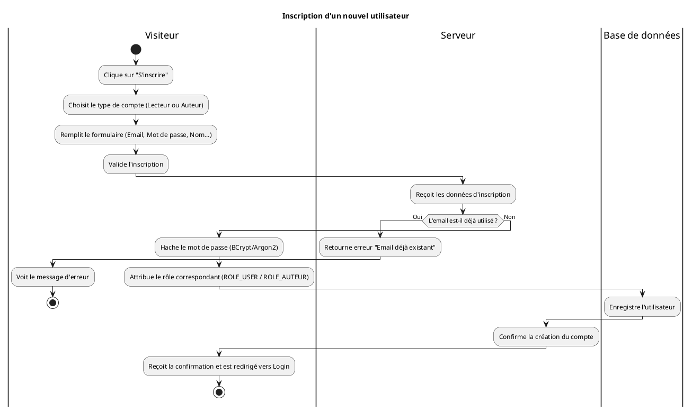

---

## Source : `Lectur_en_ligne.puml`

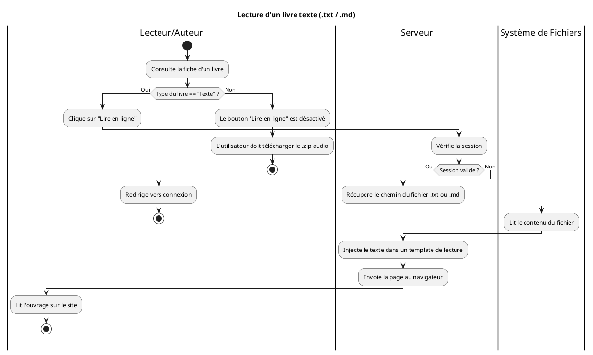

---

## Source : `Modification.puml`

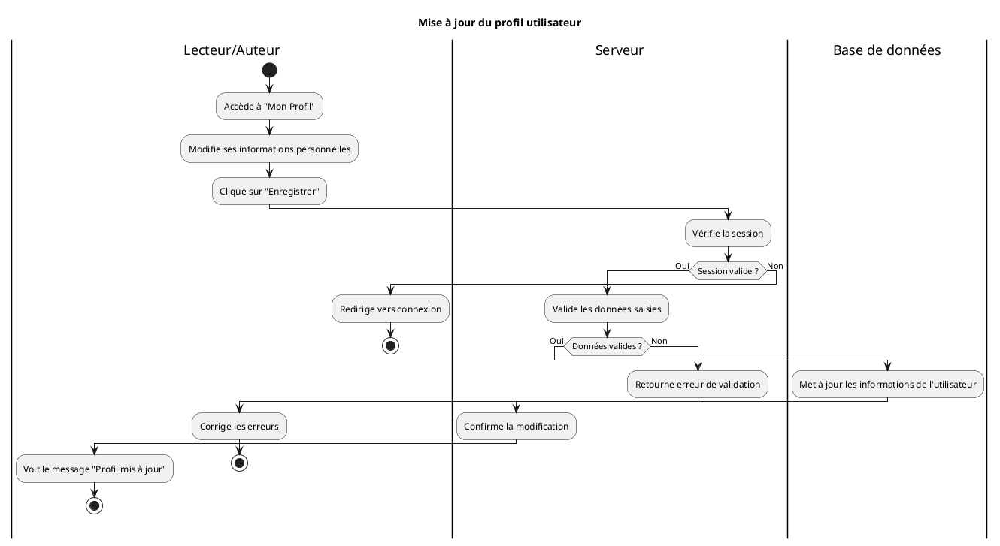

---

## Source : `Modification_livre.puml`

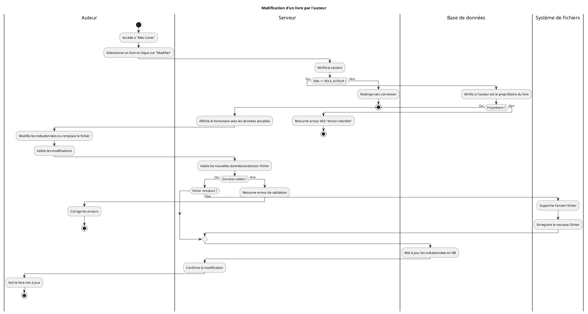

---

## Source : `Modération_livres.puml`

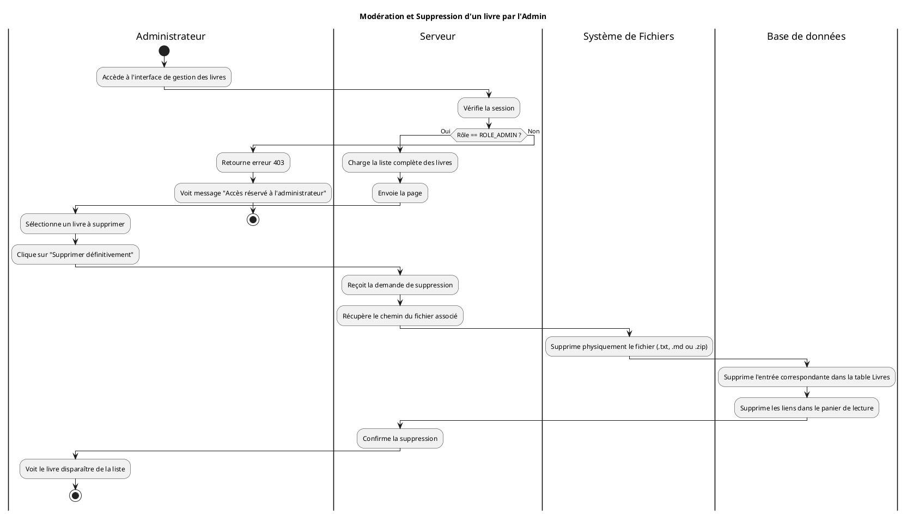

---

## Source : `Recherche_et_téléchargement.puml`

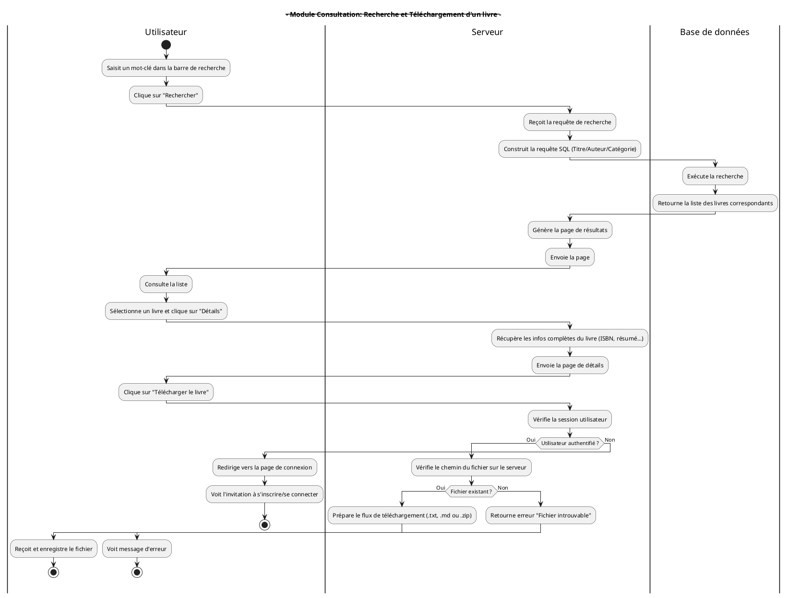

---

## Source : `Recherche_exhaustive.puml`

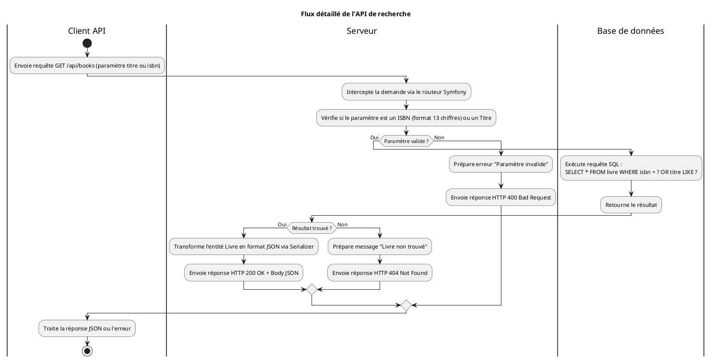

---

## Source : `Téléversement_livre.puml`

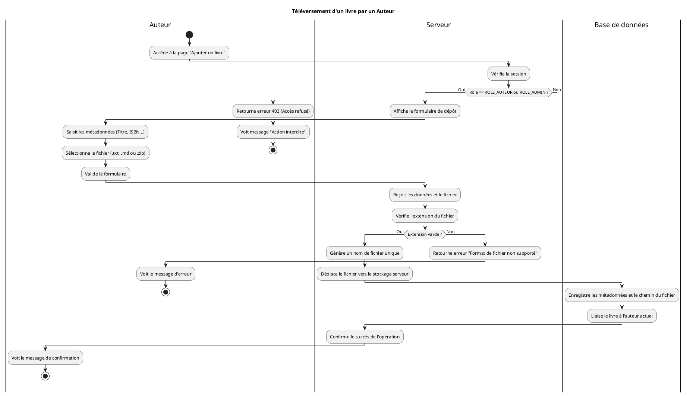

---

